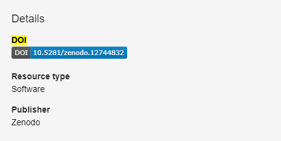
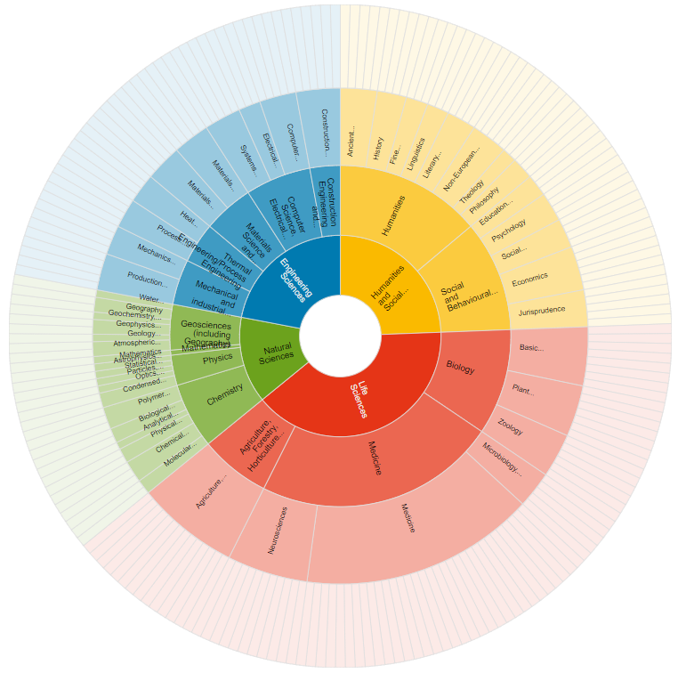
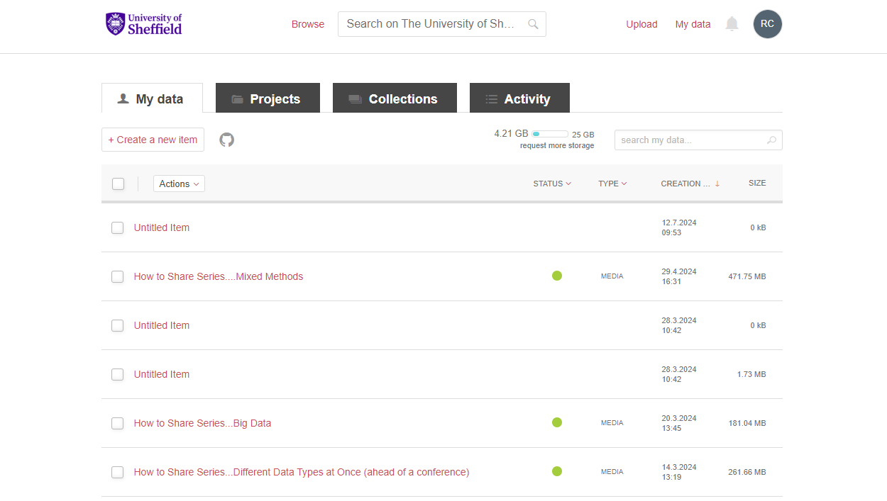
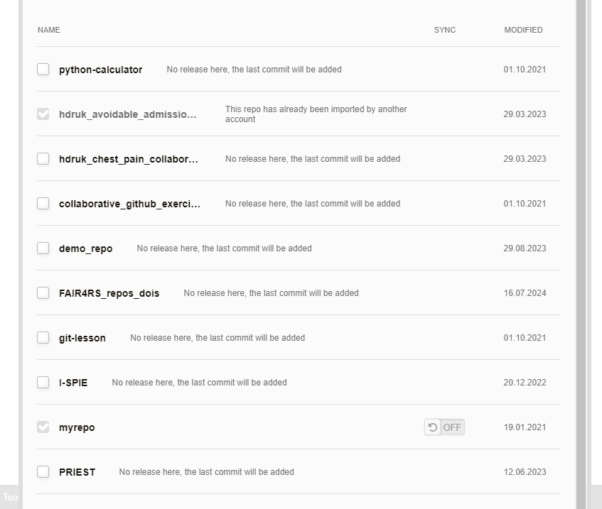

:::::::::::::::::::::::::::::::::::::: questions 

- What is a DOI?
- What good is a DOI (compared to, say, a URL), and how do I get a DOI?
- What is a repository?
- How do I choose a repository?
- How do I link GitHub to ORDA?

::::::::::::::::::::::::::::::::::::::::::::::::

::::::::::::::::::::::::::::::::::::: objectives

- Understand what a DOI is
- Understand how they differ from other ways to link to your work and how to create and source a DOI for your work
- Understand what a repository is and does
- Feel comfortable selecting a suitable repository
- Know how to link a GitHub repository to ORDA (a DOI-providing repository)

::::::::::::::::::::::::::::::::::::::::::::::::

# DOIs

## Introduction

The code that you write is important. No matter the size, style, or language, it is an integral aspect of the research that it is part of, or indeed, sometimes it is the main output of the research project.

Historically ‘research outputs’ have been focused on papers, and while this is still mostly true, there has been a change in recent years to give better acknowledgement to other research outputs, such as code. There has also been a shift (which we are continuing to see) that funders are requiring other outputs from projects to be made available. While this is mostly focused on the data that has been collected or used, in certain fields code is also part of this. You may also come across conferences or awards that require code to be available (and open) in order to submit or be considered. There’s also been a rich history of code being made free and available to others.

Regardless of the reason you want to disseminate your code, there are some ways you can make this easier for both yourself and anyone who wishes to use your code - these include DOIs, using repositories, providing metadata, and knowing how to cite yourself.

## What is a DOI?

A DOI is a type of PID. A PID is a Persistent Identifier - a reference that will continue to identify the same object, person or institution over time. A DOI is a Digital Object Identifier - a PID that refers specifically to a digital object such as an online article, dataset or archived piece of software. Each individual DOI is linked to a specific digital object and (should) always direct to that object, regardless of potential changes to its location or metadata. The most common use of DOIs is for journal articles. A single article should have a single DOI, but they can also be used for databases or software/code.

::::::::::::::::::::::::::::::::::::::: callout

# Example DOI

This is what a DOI looks like:  [10.1016/j.ascom.2020.100427](https://doi.org/10.1016/j.ascom.2020.100427)

:::::::::::::::::::::::::::::::::::::::::::::::

You’ve probably seen these many times before because, like this one, they are used for journal articles. Interestingly, the article the above DOI links to is about a tool that has been created, is freely available, and has a licence applied to it, but it provides no link to the [code/software itself](https://github.com/astrom-tom/SPARTAN).

## Isn't that just a link/URL?

No. The internet as a whole is much more fragile than most people think. There area myriad of different ways that things can break or cease to exist. While there are, of course, some old webpages that are still up for no apparent reason, and multiple archives and projects that try to capture parts of the internet ([Wayback Machine](https://web.archive.org/), [Software Heritage](https://www.softwareheritage.org/)), these are by no means complete.

But thinking of your own code, if it’s on a webpage (maybe your own), hosting isn’t free: are you planning on keeping this webpage for a long time? Can you guarantee it will never be moved from that page/URL, and do you know if other people are using that link?

::::::::::::::::::::::::::::::::::::::: callout

A DOI essentially makes it someone else's job to ensure that the link resolves to the right digital object.

:::::::::::::::::::::::::::::::::::::::::::::::

Only registered organisations can create DOI’s. To be able to mint a DOI, an organisation must meet the International DOI Foundations standards and pay to become a member, meaning that they must have the ability to ensure the DOIs are maintained.

DOIs are also designed to be short and human-readable, again unlike most URLs, whereas shortened URLs are not persistent.

## DOI and version control

Version control is of course very important around code (see the Version Control part of the FAIR^2^4RS training), and you shouldn’t create more than one DOI for a single digital object -  however you can nevertheless version with DOIs:

::::::::::::::::::::::::::::::::::::::: callout
# DOIs with multiple versions

[10.15131/shef.data.22633528**.v2**](https://doi.org/10.15131/shef.data.22633528.v2)

:::::::::::::::::::::::::::::::::::::::::::::::

That part at the end indicates which version the DOI will resolve to. If you have written some code for a research project, and the current version is the one that was used, but you are still developing it, referencing that version in any paper or outputs will allow people to see exactly what the code looked like at the time the research was conducted.

It’s important to note that if no version suffix is included in the DOI link, it will resolve to the most recent version of the object. This is sometimes exactly what is wanted and sometimes not, so it’s good to think about this when using a DOI.

## How do I get a DOI?

To get a DOI for code, the best place to use is a repository. It’s important to note that (currently) GitHub does not mint DOIs. Some examples of repositories that do are [Zenodo](https://about.zenodo.org) and the University's institutional repository, [ORDA](https://orda.shef.ac.uk).

When you make a deposit in a repository that does mint DOIs, there should be nothing extra you have to do, when it has been published, there will be a DOI that you can use to cite and refer to your work.

{alt="A screenshot of a the DOI on a Zenodo deposit"}

{alt="A screenshot of a the DOI on a ORDA deposit"}

:::::::::::::::::::::::::::::::::::: keypoints
 - DOIs are persistent identifiers that should always point to your code.
 - They should be maintained by the minting organisation, making them stronger than a URL.
 - DOIs can handle multiple versions of the same object.
 - Some repositories mint DOIs for deposits.
::::::::::::::::::::::::::::::::::::::::::::::

# Repositories

## Introduction

Hosting large amounts of data, minting DOIs, creating a usable interface for code and the ability to pull the code to other work setups all takes a lot of time and effort. This is where repositories come in. A repository will make space available to you to deposit your work. GitHub, as a whole, could be seen as a repository, although you also create repositories (repos) yourself inside GitHub. It also does a lot more than just hold your data/code, and of course its main function is version control.

In the last episode we saw some repositories - [Zenodo](https://about.zenodo.org) and the University's institutional repository [ORDA](https://orda.shef.ac.uk) -  but there are many more out there. Most repositories, certainly used in academia, tend to be fully open, so anyone can access what is deposited. 

It’s important to remember this, as you may not want, or be able to, make your code fully open to all (although we encourage you to where possible). However, there are repositories out there that have different levels of access. For example, the [UK Data Service repository](https://ukdataservice.ac.uk/) has three levels of access: open, safeguarded (users must sign the End User Licence), and controlled (users must apply for access with criteria set by the data provider). However, currently the UK Data Service does not hold code.

It’s also worth noting that there are different types of repositories. Some are purely for publications (such as the [White Rose Research Online repository](https://eprints.whiterose.ac.uk/)), whereas others are data-focused (e.g. [Harvard Dataverse](https://dataverse.harvard.edu/)).

## Differences between repositories

As we’ve just seen, not all repositories are created equal. Some are not just repositories, others aren’t technically repositories at all. This means you should put some thought into which repository you are going to use to deposit your code. 

::::::::::::::::::::::::::::::::::::::: callout

# What do you want from a repository

- Do you want your work to be fully open?
- What type of licence do you wish to apply to your work?
- Do you want a DOI?
- Do you need it to handle versioning?
- Do you need your work to be machine-accessible? 

:::::::::::::::::::::::::::::::::::::::::::::::

You may also need to think about what licence you *can* apply, as you may be limited by any third party software you are using. This is covered in more detail in the Software Licensing section of this component.

Also the last point is probably more important around data rather than code.

## Choosing a repository

As there are many different repositories out there, choosing a suitable one for your code is an important task. You may know the repository that you wish to use already, or you may wish to find a suitable subject-specific repository. Both [re3data](http://re3data.org) and [FAIRsharing](http://fairsharing.org) hold a directory of repositories that can be browsed, searched, and filtered to help you find the most suitable repository for your needs.

{alt="A screenshot of the re3data page 'Browse by subjects' showing a wheel of all subjects available"}

Both have a useful description of each repository and helpful icons to enable you to quickly answer some of the questions listed above.

Our own guidance is that you should look for a subject- or data-type-specific repository first, and if nothing is suitable or has the functionality required, then you should use ORDA (the University of Sheffield institutional repository).

:::::::::::::::::::::::::::::::::::::::: challenge

## Challenge 1: Would making my code a package be better?

If one of the main aims is to make the code you have written more (re-)usable by others, would it not be more suitable to create a package of the work, and what would be the pros and cons of doing so?

:::::::::::::::::::::::::::::::::::: hint

## Hint

Think about who 'owns' packages, how they are disseminated, and what we wanted to achieve with our code

:::::::::::::::::::::::::::::::::::::::::

:::::::::::::::::::::::::::::::: solution

## Solution

Maybe! But also probably not. The main issue is that they are different things really, or at least help and aid in different ways, but use a lot of the same vocabulary. While a package will most likely make it much easier for people to use you work (a simple install command), it often doesn't make it more citeable.

:::::::::::::::::::::::::::::::::::::::::

::::::::::::::::::::::::::::::::::::::::::::

For example, the main repository of Python packages - the Python Package Index or [PyPI](http://pypi.org) - holds over half a million projects, but does not mint a DOI for these projects. However, recently, all R packages on [CRAN](https://cran.r-project.org/) have been attributed a DOI. Now of course there's differences there in how packages are regulated, but it's a good step forward in giving the creators of packages the recognition they deserve.

This is also the issue with using just GitHub that while it holds all your work, and enables people to access, read, use, and reuse your work, it also does not mint DOIs, as its main function is to aid in version control and allow a team to work on the same project at once. Therefore, unlike other repositories, it is not so concerned with the long-term storage or archiving of work , and, while nothing has happened yet, it’s also worth remembering that GitHub is owned by Microsoft and could technically change at any time.

You can learn a lot more about packages in the FAIR^2^4RS component on this topic, including how to create and publish your own and how to automate the publication.

You may also consider the fact that while usually it is good practice to only put your work in one repository, it might be beneficial in this instance to have a package created for easy download, and also place your work in a repository that grants a DOI for better citation. (Note: it’s bad practice to gain more than one DOI for an output).

## Can this not all be automated and made simple?

There are certainly things you can do to help you manage this, but it depends on your definition of simple.

Within ORDA, you can link your account and your GitHub account.

::::::::::::::::::::::::::::::: exercise

## Challenge 2: Go to ORDA and find the button that imports from GitHub

See if you can find the button for linking a GitHub repo in [ORDA](http:/orda.shef.ac.uk)

:::::::::::::::::::::::::::::::::::::::::

:::::::::::::::::::::::::::::::: solution

## Solution

We'll go through this in a minute, but if you did actually find it, well done! Figshare (of which ORDA is an instance) does a lot right, but has some very strange decisions inside it as well.

:::::::::::::::::::::::::::::::::::::::::

## ORDA

{alt="A screenshot of the ORDA landing page"}

This is the ORDA landing page, showing my login. All University of Sheffield staff and PGRs should have an account to access ORDA as it is associated with your staff/student profile (N.B. it is also deactivated with your profile if you leave, but can be reactivated for a period if needed to allow a deposit or edit to be made).

From here, if you go to the My Data section in the top right, you will see something like this:

{alt="A screenshot of the 'My data' page in ORDA"}

You might be able to see it now, but it’s still not clear how useful that button is. Next to the ‘+ Create a new item’ button is a greyed out Octocat. Hovering over this will fill in the colour and provide the helpful words ‘Import from GitHub’. Clicking on the icon will give you this popup:

{alt="A screenshot of the popup to link a GitHub account to ORDA, found in ORDA."}

And from this you can link your account, and pull in a repo directly to ORDA. You can see from the image below that it simply allows you to select which repo you want to pull across.

{alt="A screenshot showing how your repos are displayed to pull across in ORDA"}

There are a few other bits of interest in this image as well. First, you can see that if a GitHub repo has been imported by another user, it doesn’t let you create another deposit for it (remember, this would mint another DOI for the same output), and this is across all instances of Figshare (for example that one is in the main Figshare.com instance). There is also a simple option that you can see there that allows automated updates of your GitHub repositories to be pulled into ORDA: the slider between the repo name and last modified date.

However, that automation is reliant on the use of a GitHub Action, which might not be the best approach for you ([guidance on the Action](https://github.com/figshare/github-upload-action)).

Alternatively you could use Figshare's API to automate the creation of a new version. There's a much more detailed description and example of how to do this in the Packages component of this course.

As mentioned above, if you are thinking of having both a package in a repository, and depositing somewhere else to get a DOI, this is something you give good consideration to, as they may be extra work to ensure that there are not different versions of your work in different places.

## Zenodo

Of course, these are not the only places you can use. Similarly in practice, you can deposit a GitHub repo in Zenodo. GitHub provides [guidance](https://docs.github.com/en/repositories/archiving-a-github-repository/referencing-and-citing-content) on how to do this.

:::::::::::::::::::::::::::::::::::: keypoints
 - There are numerous repositories available and you should consider what you want from one
 - Some are better than others depending on your purpose and needs
 - GitHub doesn’t mint DOIs, but you can link your GitHub repos to a repository that does
::::::::::::::::::::::::::::::::::::::::::::::
