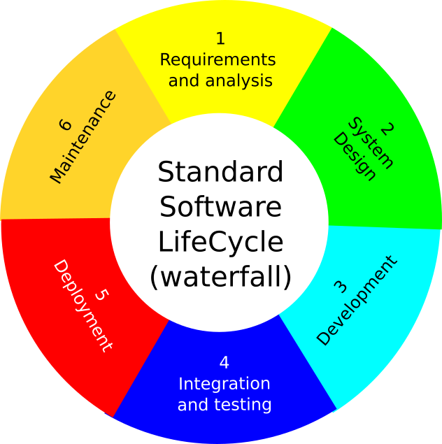

:::::::::::::::::::::::::::::::::::::: questions 

- How do we defne software in research?
- What is the classical software lifecycle?
- What are the FAIR principles applied to research software?

::::::::::::::::::::::::::::::::::::::::::::::::

::::::::::::::::::::::::::::::::::::: objectives

- Understand the definition of software in research.
- Get to know the software lifecycle and how it applies to research software.

::::::::::::::::::::::::::::::::::::::::::::::::

## What is a software in academia?

It is not always easy to define what constitutes a software in research. The size of projects can vary from a small script of a few dozens of lines to a massive project with millions of lines. If you are interested in a discussion around a research software definition you can have a look [here](https://zenodo.org/records/5504016). For the shortcut version, here is a definition of research software that we are going to consider:

::::::::::::::::::::::::::::::::::::: keypoints 

Research Software includes source code files, algorithms, scripts, computational workflows and executables that were created during the research process or for a research purpose. Software components (e.g., operating systems, libraries, dependencies, packages, scripts,etc.) that are used for research but were not created during or with a clear research intent should be considered software in research and not Research Software. This differentiatio nmay vary between disciplines.

::::::::::::::::::::::::::::::::::::::::::::::::

## Reminder: The FAIR principles applied to research software

## The software lifecyle

A traditional software lifecycle (in a non-academic setup) involved the following phases:

{ width=50% }

* 1 - **Requirements and Analysis**: Requirements are gathered from stakeholders (client, users) and analysed. From this, the Software Requirement Specification document is produced outlining all funcional and non-functional requirements. The focus here is on understand what the system is supposed to do without going into details of implementation

* 2 - **System design**: That stage creates the bluepring for bilding the system. It identifies the architecture, the components and their interaction but also focusing on the details of each components (data structure, databases, input/output).

* 3 - **Development**: This is where the coding takes place. The developer will write the code based on the SPS and ensure that it meets requirements. It is often done by creating small building blocks.

* 4 - **Integration and testing**: Once the code is written, the individual block are integrated to a complete system and various testing are conducted (e.g. unit tests, integration tests).

* 5 - **Deplyoment**: Once the software is fully tested and ready, it is eployed to the production environment or delivered to the client. This is at this stage that the software is available to end-users.

* 6 - **Maintenance**: At this stage, the software enters the maintenance phase where it is monitored, updated and fixed if necessary. Corrective maintenance fixes bugs, while adaptive and perfective maintenance improve the software's performance or add new functionalities. 

It is quite a rigid framework that does not really adapt well to changes. This framework is often called a waterfall model. Nevertheless it is possible to adapt it to research the academic framework. That what we will see in the software management plan in the next chapter. 
